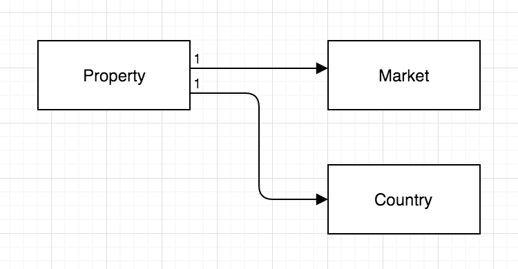

# Test - Stories

Build a javascript application that handles property locations.

## 1. Mapping

### 1.1 
As a member of a Real Estate team I need to see all properties on a map so that I can understand a market and find the best places for new properties.

#### Done Criteria:

    - Google map with one pin per property.
    - Map centered in Manhattan.

### 1.2
As a member of a Real Estate team I want to understand basic information about a property so that I can understand it in its geographic context.

#### Done Criteria:

    - Clicking on the pin opens a lightbox with: Name, Address, Market.
    - Lightbox should have a close button.
    - If lightbox is open, map interaction should be disabled.

## 2. Entity Management (CRUD - Grid & forms)

### 2.1 
As a member of a real Estate team I need to manage information about properties so that all members of my team can leverage property information in the system.

#### Done Criteria
    - Ability to add and edit properties
    - Validation
        - Required: name, address, market, latitude, longitude.
    - Optional:
        - select a pin on the map to get its latitude and longitude coordinates

### 2.2 
As a member of a Real Estate team I need to see a list of all properties so that I can quickly make comparisons between multiple properties.

#### Done Criteria
    - Grid showing all properties, ordered by name descending.
    - Clicking on the name field opens the property edit form. After saving, the change should be reflected in the grid.

# More Information:

  - clone and install: https://github.com/WeConnect/physical-systems-api-test
  - Api handling and documentation (how to interact with the api): https://github.com/typicode/json-server
  - Entity Relations:
  
